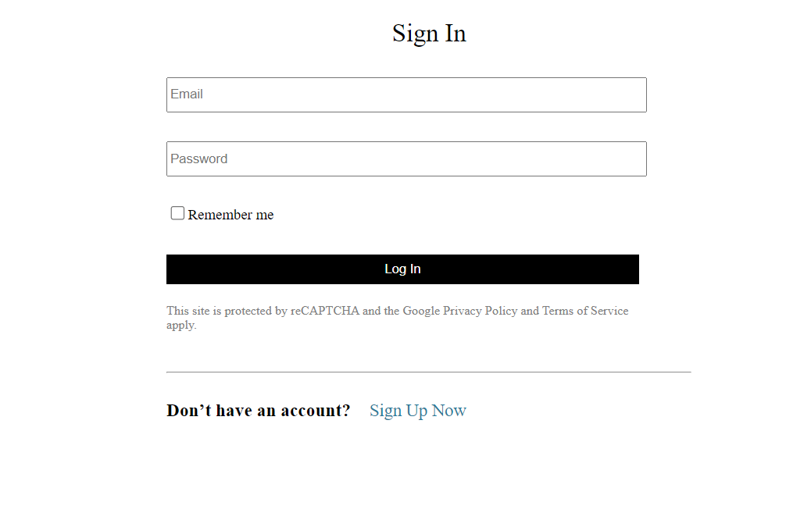
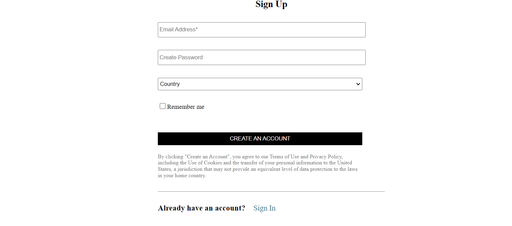
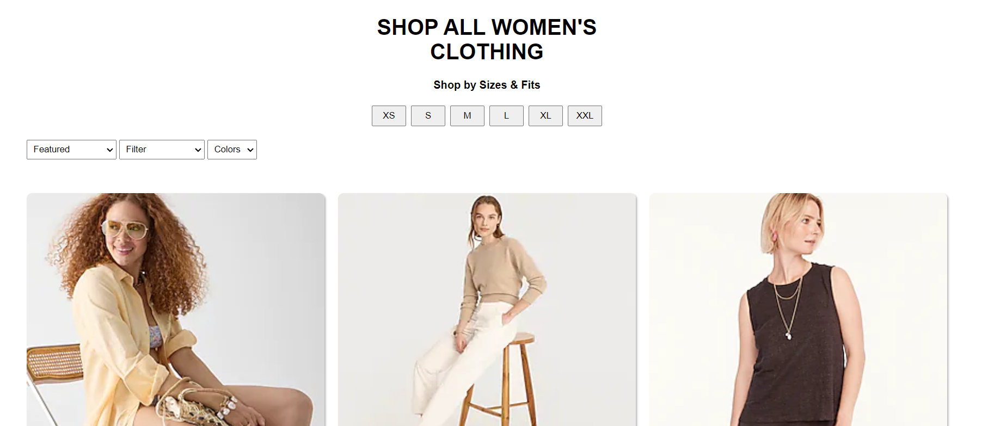
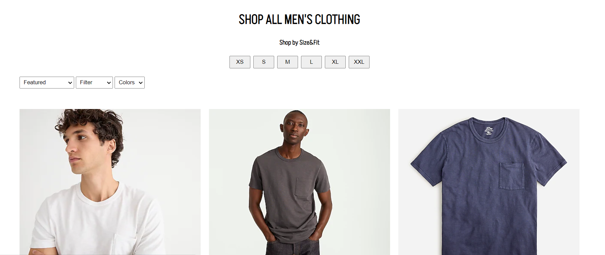
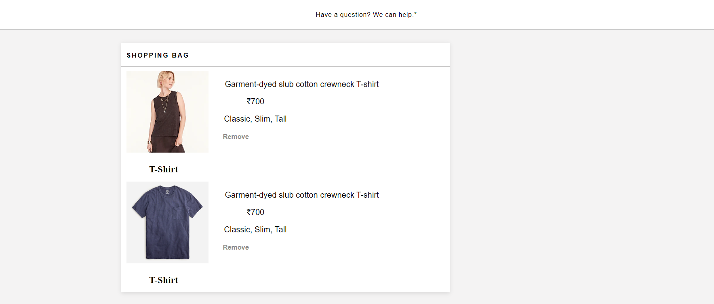
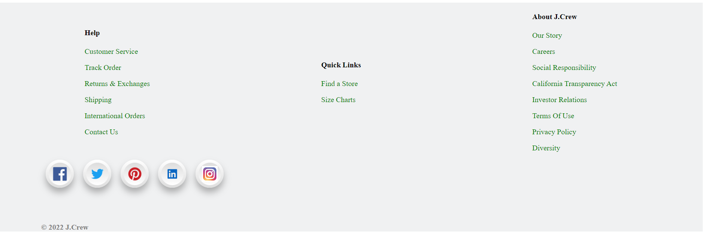

## JCrew 

## Badges

The company offers an assortment of women's, men's, and children's apparel and accessories, including swimwear, outerwear, lounge-wear, bags, sweaters, denim, dresses, suiting, jewelry, and shoes. Find new arrivals, fashion catalogs, collections & lookbooks every week.
## Technologies we used

- HTML
- CSS
- JAVASCRIPT
- Browser LocalStorage

## Features

- There is login and logout functionality.
- Elegant navbar for easy navigation between pages and categories.
- Customers can view the Product list of a particular category.

## Screenshots
A glimpse of our website

- On this page users can signup/sign-in based on whether the user is already registered or not.

Step :- 1

Step :- 2

- The landing page.

- on the checkout page,  address and credit card details in order to place the order.

- There is footer page where the user see terms and condition and connected to our social sites

 [Demo link here](https://kaleidoscopic-torrone-494925.netlify.app/) 

## Author

- [Nitesh Sindhu](https://github.com/NiteshSindhu)
- [Ashirvad Kumar](https://github.com/Ashirvad121)
- [Kishan Joshi](https://github.com/Kishan0431)
- [Owaiss Hassan](https://github.com/owaisshassan)
- [BikramJeet Singh](https://github.com/VickypediaSingh)